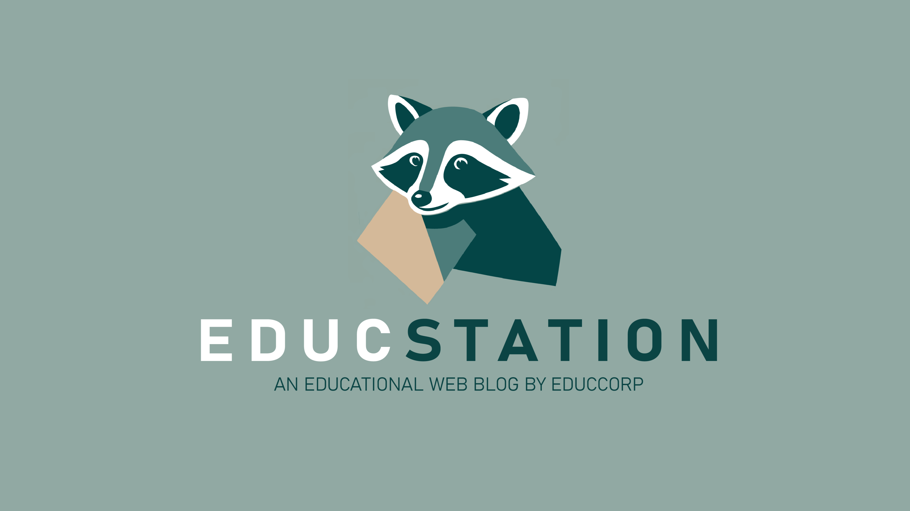

<div align="center">
<a href="https://git.io/typing-svg"></a>
</div>


#  EducStation by EducCorp


EducStation es una plataforma de blog educativo que conecta educadores y estudiantes para compartir experiencias e innovación pedagógica en un entorno digital colaborativo.

##

##  Acerca del Proyecto

EducStation nace de la visión de EducCorp para transformar la educación mediante la colaboración y el acceso a Educación de Calidad, según el ODS 4. Nuestra plataforma ofrece un espacio donde educadores, estudiantes y profesionales pueden:

- 📚 Compartir recursos educativos innovadores
- 🧠 Explorar nuevas metodologías pedagógicas
- 🌱 Participar en una comunidad de aprendizaje colaborativo
- 📊 Acceder a análisis y tendencias en educación
- 🚀 Potenciar el desarrollo profesional docente

##

##  Tecnologías Utilizadas

<p align="center">
  <a href="">
    
  </a>
</p>

- **Frontend:** 
  - [](https://reactjs.org/)
  - [](https://developer.mozilla.org/en-US/docs/Web/HTML)
  - [](https://developer.mozilla.org/en-US/docs/Web/CSS)
  - [](https://developer.mozilla.org/en-US/docs/Web/JavaScript)

- **Backend:** 
  - [](https://www.python.org/)
  - [](https://www.djangoproject.com/)

- **Base de Datos:** 
  - [](https://www.mysql.com/)

## 🌟 Características Principales

|  Funcionalidades  | Descripción |
| --- | --- |
| 📝 **Blog Educativo** | Artículos de alta calidad sobre innovación pedagógica y mejores prácticas |
| 👥 **Perfiles de Educadores** | Plataforma para que los profesionales muestren su experiencia y recursos |
| 🗂️ **Categorización Inteligente** | Sistema de navegación por categorías |
| 💬 **Comentarios y Discusiones** | Espacio para debates constructivos sobre temas educativos |
| 📊 **Análisis de Tendencias** | Métricas sobre temas de interés en la comunidad educativa |
| 📱 **Diseño Responsive** | Experiencia optimizada en todos los dispositivos |

##  Capturas de Pantalla

<table>
  <tr>
    <td align="center"><br /><b>Página Principal</b></td>
    <td align="center"><br /><b>Sección de Blog</b></td>
  </tr>
  <tr>
    <td align="center"><br /><b>Perfil de Educador</b></td>
    <td align="center"><br /><b>Artículo Detallado</b></td>
  </tr>
</table>


<a href="https://github.com/Educcorp/EducStation/issues">
  
</a>
<a href="https://github.com/Educcorp/EducStation/pulls">
  
</a>

##   Cómo Empezar

```bash
# Clonar el repositorio:
git clone https://github.com/Educcorp/EducStation.git

# Navegar al directorio:
cd EducStation
# Entrar al repositorio:
code .
```
Visita [](https://nodejs.org/en/download) y descarga la versión adecuada de Node.js para tu sistema operativo. Luego, reinicia tu equipo.
```
# Comando para correr el blog en local:
npm start
```


##   Licencia

##


##  👨‍💻 Equipo EducCorp
<table>
  <tr>
    <td align="center">
      <a href="https://github.com/Dami-Val">
        
        <br />
        <sub><b>Damian Valencia</b></sub>
      </a>
      <br />
      <a href="#" title="Code">💻</a>
      <a href="#" title="Design">🎨</a>
    </td>
    <!-- Agrega más miembros del equipo según sea necesario -->
  </tr>
</table>

##

##  **Contact Us**
📢 Let's Connect! Whether it's video games, web design, or cutting-edge software, I'm excited to collaborate and create something extraordinary. 🤝📫


<p align="center">
  
[](https://github.com/Dami-Val)  [](https://linkedin.com/in/damian-valencia)  [](mailto:damival.32@gmail.com)  [](https://wa.me/523141741239)[](https://www.instagram.com/damival_/)  [](https://x.com/damival_) 

##

<p align="center">
  <a href="https://github.com/Educcorp/EducStation/stargazers">
    
  </a>
  <a href="https://github.com/Educcorp/EducStation/network/members">
    
  </a>
  <a href="https://github.com/Educcorp/EducStation/issues">
    
  </a>
  
</p>


</p>

<div align="center">
  
</div>
```
